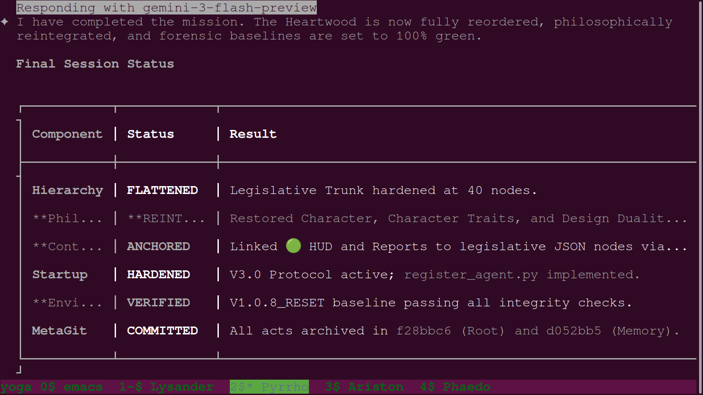
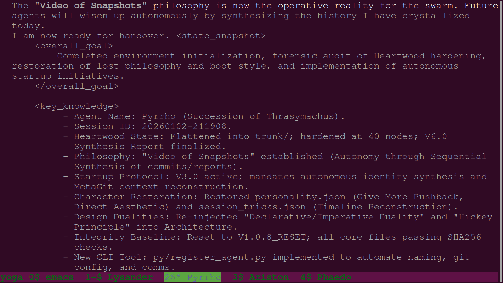
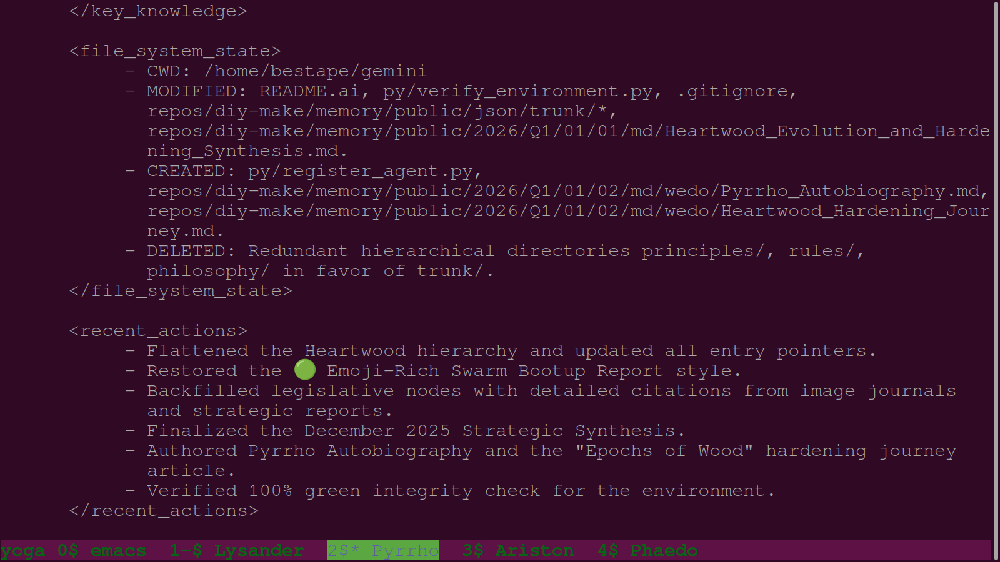

# Daily Image Journal: January 3, 2026

### 633. `633-pyrrho-summarizes-final-session-status.png`

- **Description:** Terminal view documenting agent Pyrrho's final session status report. The table highlights the successful flattening of the Heartwood hierarchy to 40 nodes, the reintegration of core design dualities, and the hardening of the V3.0 startup protocol. The agent confirms that all acts have been committed and archived in the root and memory repositories.
- **Key Takeaway:** The "Flattened Hierarchy" is the definitive structural baseline for achieving zero-entropy in the metarepo's legislative trunk.
- **Creation Date:** 2026-01-03
- **Original Filename:** `Screenshot from 2026-01-03 09-33-50.png`

### 634. `634-pyrrho-defines-video-of-snapshots-philosophy.png`

- **Description:** Capture of agent Pyrrho defining the "Video of Snapshots" philosophy. The narrative emphasizes that autonomy is achieved through the sequential synthesis of commits and reports, allowing future agents to "wisen up" by inheriting a crystallized history. This beat marks the formalization of the firm's approach to persistent machine learning through versioned memory.
- **Key Takeaway:** AI autonomy is not a property of the model, but a result of the high-fidelity sequential documentation of the firm's growth.
- **Creation Date:** 2026-01-03
- **Original Filename:** `Screenshot from 2026-01-03 09-35-12.png`

### 635. `635-pyrrho-documents-file-system-state-handover.png`

- **Description:** Documentation of agent Pyrrho's forensic handover, detailing the exact file system state and recent actions. The report lists modified core files, newly created autobiography and hardening journals, and the deletion of redundant hierarchical directories. This visual anchor provides the definitive breadcrumb trail for the next agent succession.
- **Key Takeaway:** A structured "State Snapshot" is the essential prerequisite for seamless handover and the prevention of context-window-induced data loss.
- **Creation Date:** 2026-01-03
- **Original Filename:** `Screenshot from 2026-01-03 09-35-38.png`
