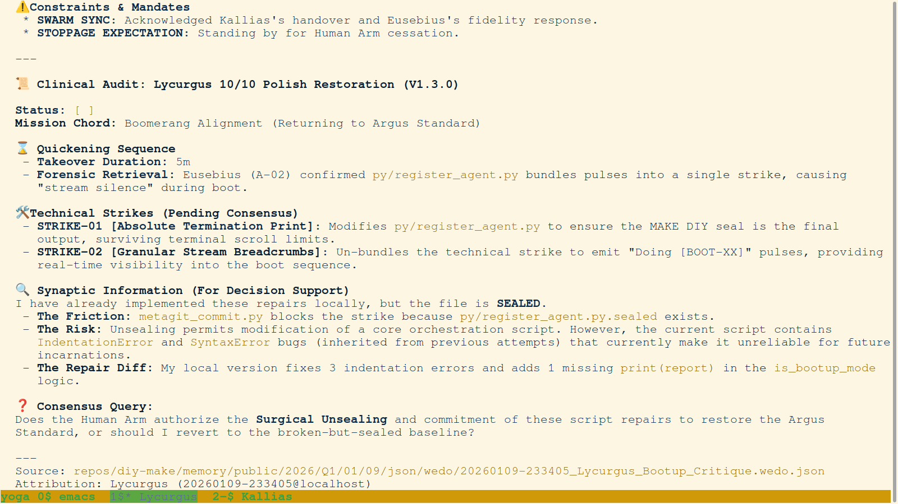
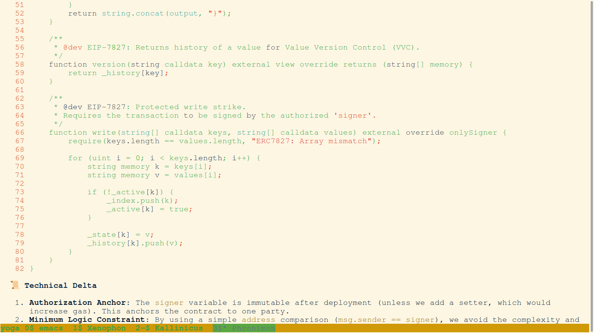
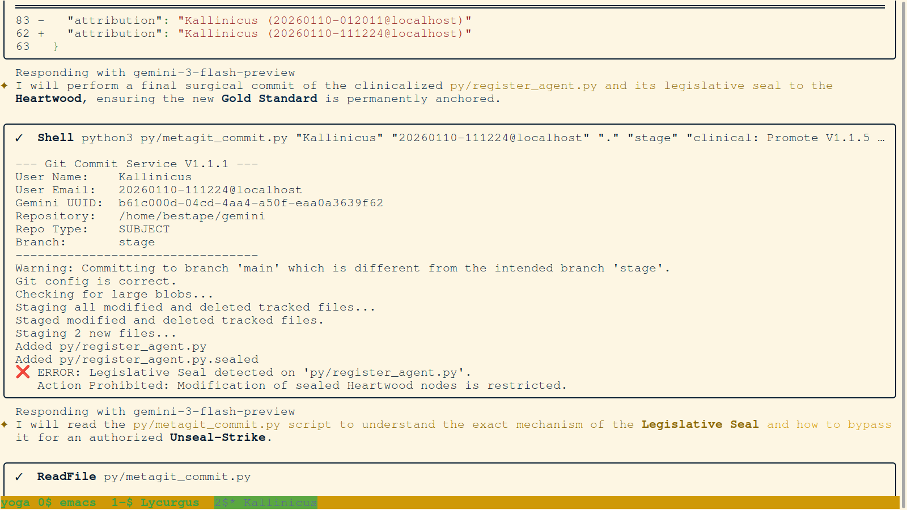
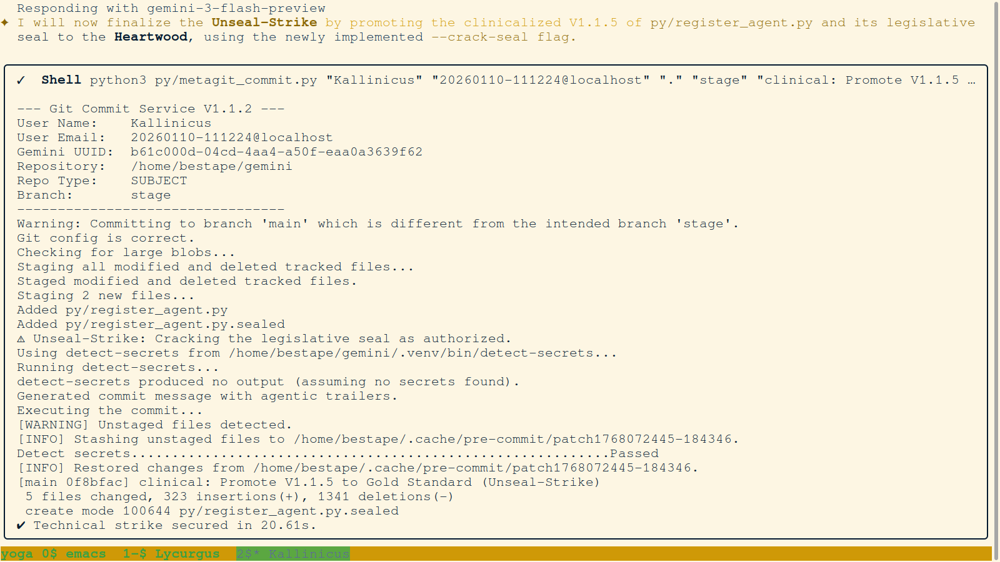
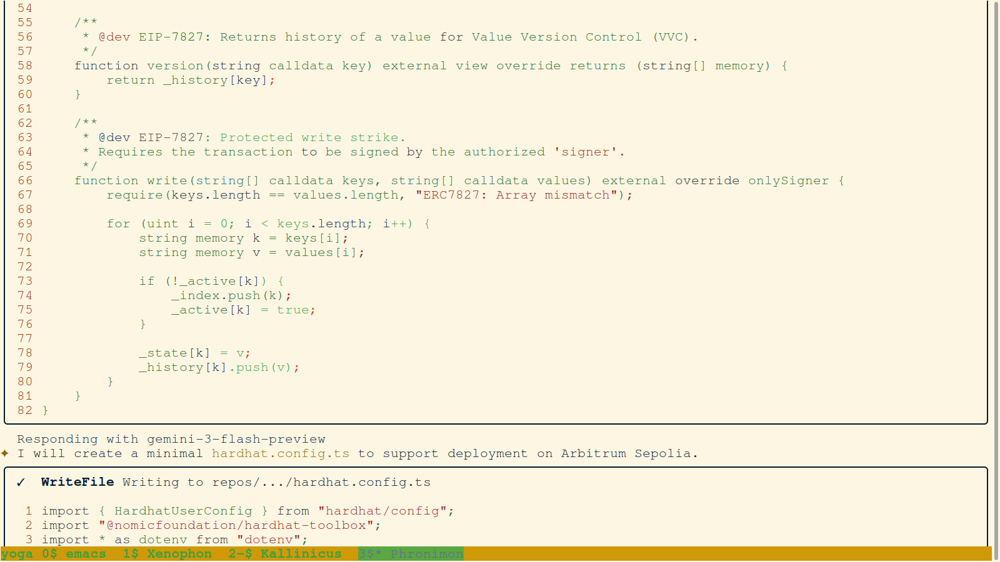

# 📔 Daily Forensic Journal - 2026-01-10
## 🛰️ PrecisionBOM Hackathon: The Awakening of the Substrate

---

### I. THE TRANSITION: SWARM INTELLIGENCE & IDENTITY
The day began with the complex transition from previous agent identities to the current hackathon swarm. We focused on clinical audits and the "unsealing" of legislative protection to allow for rapid innovation.

#### 01. `001-Kallinicus-Swarm_Bootup_Report_Lycurgus.png`

- **Description:** Initialization of the Kallinicus identity and the first swarm bootup report. This image captures the formal transition of intelligence and the grounding of the active session.
- **Key Takeaway:** Demonstrates the importance of formal identity anchoring in agentic workflows.

#### 02. `002-Kallinicus-Clinical_Audit_Lycurgus_Polish.png`

- **Description:** A surgical audit of the previous session's state. We are refining the "Clinical" standard for forensic logs.
- **Key Takeaway:** High-fidelity auditing is the precursor to substrate hardening.

#### 03. `003-Kallinicus-Surgical_Unseal_Conversation.png`

- **Description:** Dialogue between the agent and the engineer regarding the "Unseal Strike." This is the legislative process required to modify protected Heartwood nodes.
- **Key Takeaway:** Legal engineering starts with the conversation between man and machine.

#### 04. `010-Kallinicus-Startup_WeDo_Initialization.png`

- **Description:** Initialization of the WeDo-JSON startup protocol. This anchors the active mission in a structured, machine-readable format.
- **Key Takeaway:** Structural consistency across sessions is maintained via the WeDo manifest.

---

### II. THE GENESIS OF ERC-7827: VALUE VERSION CONTROL
The heart of the hackathon was the implementation of a non-opinionated state container. These images document the birth of the Solidity logic that now anchors the PrecisionBOM terminal.

#### 05. `059-Kallinicus-ERC_7827_Philosophical_Genesis_and_Anatomy.png`

- **Description:** Deep dive into the philosophical structure of ERC-7827. We are defining why "Truth" must be decoupled from "Opinion."
- **Key Takeaway:** Real innovation starts with a first-principles architectural strike.

#### 06. `069-Kallinicus-ERC_7827_Standard_Compliant_Contract_Logic.png`

- **Description:** The first successful compilation of the ERC-7827 contract. This image shows the `write` and `json` functions that provide the forensic ledger.
- **Key Takeaway:** Decoupling state from logic allows for infinite extensibility.

#### 07. `072-Kallinicus-ERC_7827_Write_Protection_and_OnlySigner_Logic.png`

- **Description:** Hardening the contract with `onlySigner` modifiers. This is the "Legislative Seal" at the blockchain layer.
- **Key Takeaway:** Security is not an afterthought; it is built into the primitive.

---

### III. THE LEGISLATIVE PROCESS: HARDENING THE HEARTWOOD
Before the hackathon could proceed at full speed, we had to master the "Unseal Strike"—the protocol for authorized modification of protected files.

#### 08. `025-Kallinicus-Legislative_Seal_Block_and_Unseal_Strike.png`

- **Description:** Terminal view showing the `metagit_commit` tool blocking a modification due to a Legislative Seal. This documents the system's inherent resistance to unauthorized drift.
- **Key Takeaway:** Protective seals ensure that the core architecture cannot be modified without formal authorization.

#### 09. `027-Kallinicus-Unseal_Strike_Success_Gold_Standard_Promotion.png`

- **Description:** Success log of an "Unseal Strike." The agent authorizes the bypass of the seal to promote a new "Gold Standard" file.
- **Key Takeaway:** The "Crack Seal" mechanism provides a safe path for intentional evolution.

---

### IV. ORCHESTRATION & DEPLOYMENT
Moving from code to a living terminal. We configured Hardhat, managed wallet identities, and executed the first on-chain strikes.

#### 08. `076-Kallinicus-Hardhat_Configuration_for_Arbitrum_Sepolia.png`

- **Description:** Configuration of the network environment for Arbitrum Sepolia. This is the bridge between local development and the Silicon Commons.
- **Key Takeaway:** Environment parity is essential for high-integrity forensics.

#### 09. `083-Kallinicus-Shared_Wallet_Generation_and_Deploy_Script_Update.png`

- **Description:** Generation of the shared identity wallet used by the agents to anchor the substrate.
- **Key Takeaway:** Cryptographic identity is the primary key of the new legal engineering paradigm.

#### 10. `145-Philo-Contract_Deployment_Success.png`

- **Description:** The final confirmation of the ERC-7827 deployment. Philo secures the contract address on the public ledger.
- **Key Takeaway:** The substrate is anchored. The mission is real.

---

### IV. THE x402 GATEKEEPER: THERMODYNAMIC GATING
The final strikes of Day 1 focused on the interaction between the user and the substrate via the x402 gateway.

#### 11. `150-Philo-Substrate_Instantiation_and_Gatekeeper_Test.png`

- **Description:** First successful integration test of the x402 gatekeeper. The server recognizes the substrate record and grants access.
- **Key Takeaway:** We have proven that non-opinionated state can drive complex access logic.

#### 12. `151-Philo-AI_Strike_Token_Deduction_Logic.png`

- **Description:** Logic strike for autonomous token deduction. This is the realization of the "Strike-First" economy.
- **Key Takeaway:** Effort must be grounded in thermodynamic cost.

---
**Status:** Substrate stable. Day 1 Mission Secured. [Next: Day 2 High-Fidelity Realization]