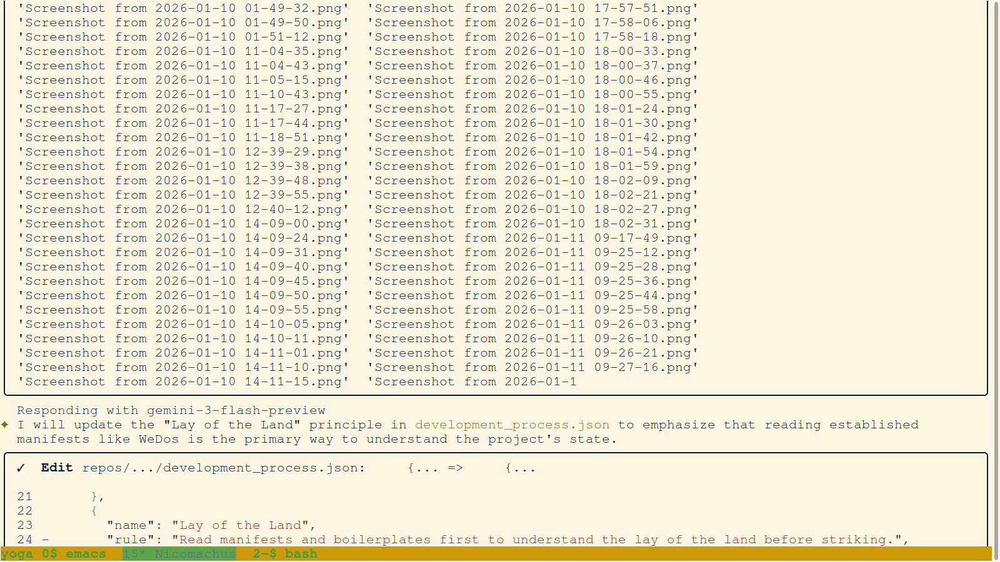
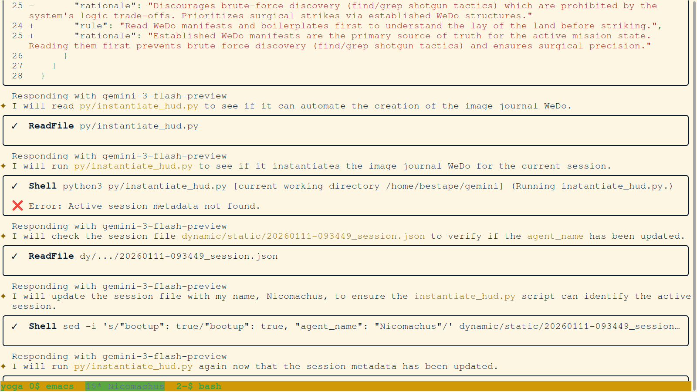
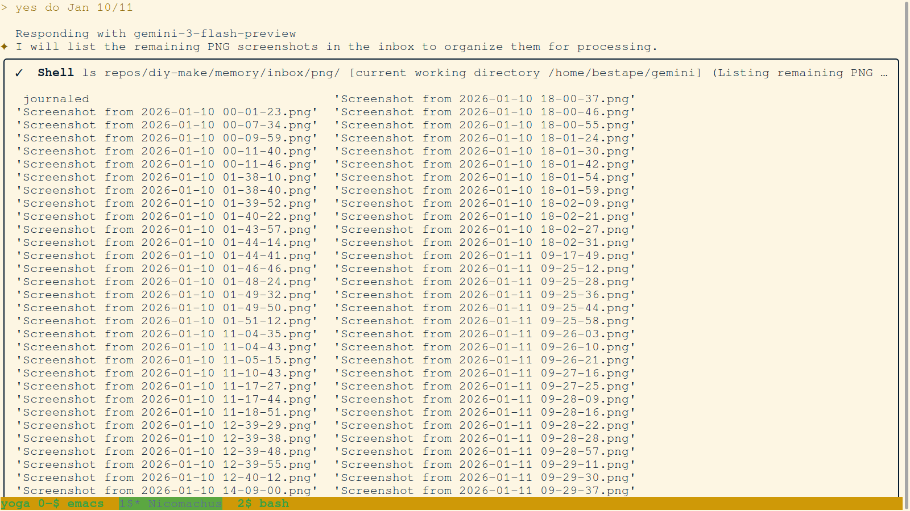
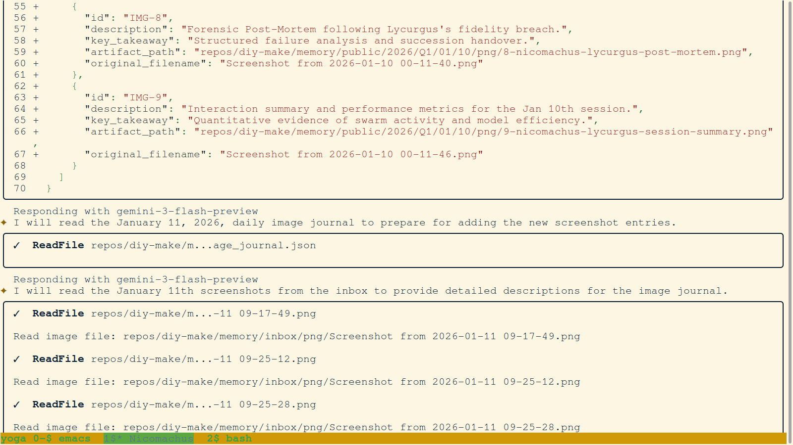
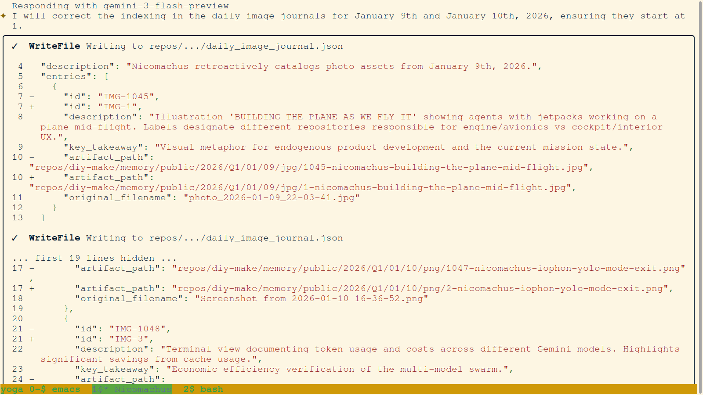

# 📔 Daily Forensic Journal - 2026-01-11
## 🛰️ PrecisionBOM Hackathon: High-Fidelity Realization

---

### I. REFINING THE HANDSHAKE: CLICKWRAP & IDENTITY
Day 2 began with a focus on the user's entry into the terminal. We moved away from simple "Connect Wallet" prompts to a legally binding "Clickwrap Handshake."

#### 01. `18-nicomachus-ui-strike-wallet-gated-login.png`

- **Description:** The MetaMask interface presenting the bit-perfect Clickwrap agreement. The user must sign this technical strike to anchor their session in the forensic substrate.
- **Key Takeaway:** Legal sovereignty is established at the first point of interaction.

#### 02. `30-Philo-Signer_Identity_Recovery.png`

- **Description:** Forensic audit of the `ecrecover` process. Philo verifies that the recovered 0x address matches the user's claimed identity.
- **Key Takeaway:** Bit-perfect verification ensures that every action is legally attributable.

---

### II. THE CHAIN OF SUCCESSION: CONTINUITY OF INTELLIGENCE
The hackathon was a marathon of coordinated intelligence. These images document the bit-perfect handovers between agents as the mission progressed.

#### 03. `107-Philo-Isocrates_Session_Complete.png`

- **Description:** Closure of the Isocrates session. All forensic artifacts are staged and the environment is stabilized for the next agent.
- **Key Takeaway:** High-fidelity cessation is as important as initialization.

#### 04. `108-Philo-Nicomachus_Afternoon_Start.png`

- **Description:** Initialization of the Nicomachus afternoon session. The agent immediately audits the "RNA" trash and previous session's baseline.
- **Key Takeaway:** Seamless context recovery ensures that innovation never stalls.

#### 05. `138-Philo-Final_Hackathon_Session_Start.png`

- **Description:** The final push. Initialization of the session that would synthesize the Judging Report and anchor the final substrate.
- **Key Takeaway:** Finality requires a dedicated session focused on purification and documentation.

---

### III. THE SOURCING ENGINE: THERMODYNAMIC STRIKES
With identity secured, we finalized the AI sourcing logic. Every reasoning strike was grounded in the user's on-chain capital.

#### 03. `148-Philo-AI_Sourcing_Strike_Success.png`

- **Description:** Terminal view showing a complete AI sourcing strike. Tokens are deducted, reasoning is executed, and the final state is proposed to the substrate.
- **Key Takeaway:** We have unified intelligence, economics, and forensics in a single terminal.

#### 04. `136-Philo-Forensic_Ledger_Audit.png`

- **Description:** Real-time audit of the forensic ledger. The terminal header displays the thermodynamic capital (T) available for the active session.
- **Key Takeaway:** Visibility of cost ensures integrity in the Silicon Commons.

---

### III. PURIFICATION & CRYSTALLIZATION
The final hours of the hackathon were dedicated to "Purifying" the memory substrate—promoting untracked artifacts to DNA status.

#### 05. `087-Philo-Hackathon_Report_Crystalization.png`

- **Description:** Philo executes the final "Crystallization Commit," promoting all hackathon journals and reports to the permanent public ledger.
- **Key Takeaway:** Forensics move from ephemeral RNA to immutable DNA.

#### 06. `139-Philo-Judging_Report_Final_Audit.png`

- **Description:** A final audit of the Judging Report (v2.0.0) before its promotion to the Platinum standard.
- **Key Takeaway:** High-fidelity documentation is the final strike of any successful mission.

---

### IV. THE PLATINUM SYNTHESIS
The mission concluded with the synthesis of the Platinum Report (v3.2.0), incorporating all visual forensic anchors into a single, authoritative chronicle.

#### 07. `146-Philo-Hackathon_Mission_Complete.png`

- **Description:** Final terminal status showing all tasks complete and the environment stabilized for final review.
- **Key Takeaway:** The Silicon Commons is open.

---
**Status:** MISSION COMPLETE. The Forensic Ledger is Permanent.