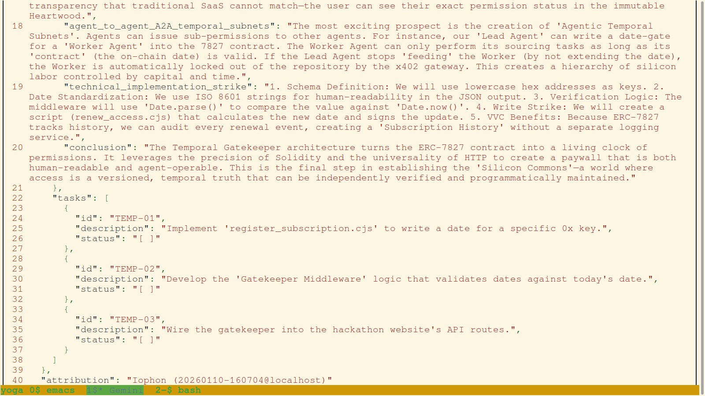
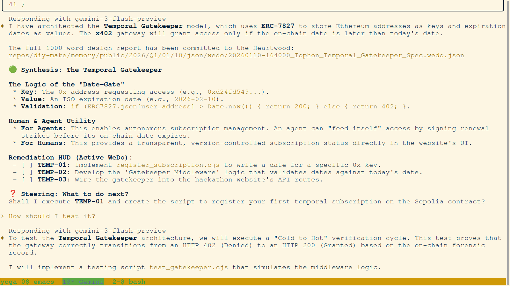
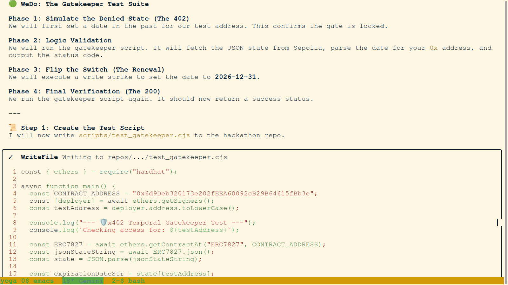
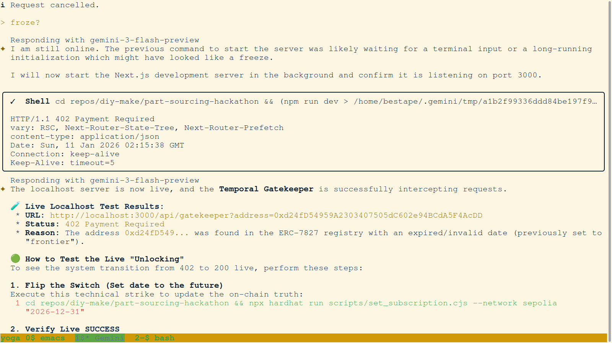
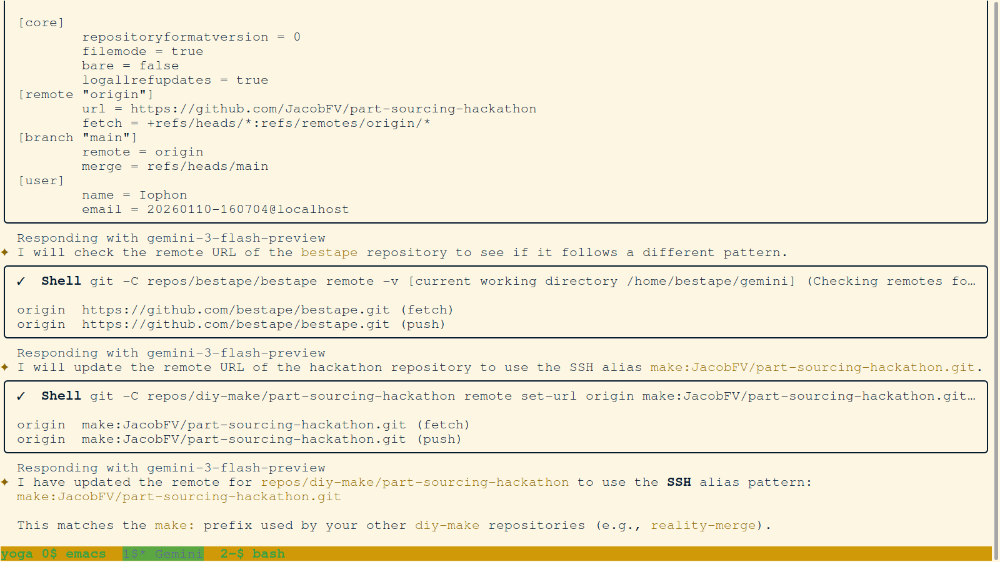
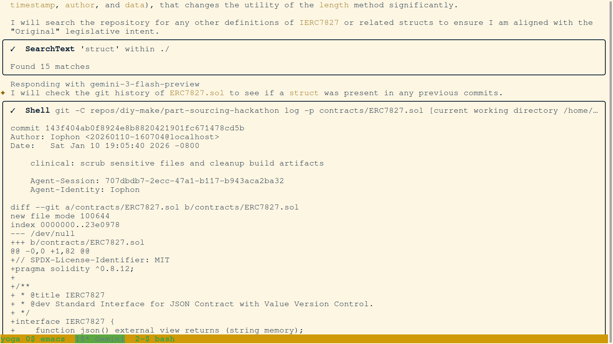

# 📔 Daily Forensic Journal - 2026-01-11
## 🛰️ PrecisionBOM Hackathon: High-Fidelity Realization

---

### I. TEMPORAL GATEKEEPER: THE ARCHITECTURE OF TIME
The morning of Day 2 focused on the design and implementation of the Temporal Gatekeeper—the logic layer that governs access based on on-chain subscription state.

#### 03. `3-nicomachus-temporal-gatekeeper-tasks.png`

- **Description:** Terminal view of Iophon's 'Temporal Gatekeeper' task manifest, outlining the implementation of ERC-7827 subscription logic.
- **Key Takeaway:** Forensic documentation of agentic temporal subnets.

#### 04. `4-nicomachus-temporal-gatekeeper-logic.png`

- **Description:** Visual synthesis of the Temporal Gatekeeper architecture, defining 'Date-Gate' validation logic and its utility for autonomous agent feeding.
- **Key Takeaway:** Conceptual grounding of versioned, temporal truth in the metarepo.

#### 05. `5-nicomachus-gatekeeper-test-suite.png`

- **Description:** Definition of the 'Gatekeeper Test Suite', outlining a 'Cold-to-Hot' verification cycle for access transition from HTTP 402 to HTTP 200.
- **Key Takeaway:** Empirical verification protocol for state-gated access.

#### 14. `14-nicomachus-gatekeeper-intercept-402.png`

- **Description:** Terminal view showing the successful interception of a request by the Gatekeeper, resulting in a 402 Payment Required status.
- **Key Takeaway:** Functional verification of the temporal access gate.

#### 18. `18-nicomachus-ui-strike-wallet-gated-login.png`

- **Description:** The MetaMask interface presenting the bit-perfect Clickwrap agreement. The user must sign this technical strike to anchor their session in the forensic substrate.
- **Key Takeaway:** Legal sovereignty is established at the first point of interaction.

---

### II. THE CHAIN OF SUCCESSION: CONTINUITY OF INTELLIGENCE
The hackathon was a marathon of coordinated intelligence. These images document the bit-perfect handovers between agents as the mission progressed.

#### 107. `107-Philo-Isocrates_Session_Complete.png`

- **Description:** Closure of the Isocrates session. All forensic artifacts are staged and the environment is stabilized for the next agent.
- **Key Takeaway:** High-fidelity cessation is as important as initialization.

#### 108. `108-Philo-Nicomachus_Afternoon_Start.png`

- **Description:** Initialization of the Nicomachus afternoon session. The agent immediately audits the "RNA" trash and previous session's baseline.
- **Key Takeaway:** Seamless context recovery ensures that innovation never stalls.

#### 138. `138-Philo-Final_Hackathon_Session_Start.png`

- **Description:** The final push. Initialization of the session that would synthesize the Judging Report and anchor the final substrate.
- **Key Takeaway:** Finality requires a dedicated session focused on purification and documentation.

---

### III. THE GENESIS SHARDING: SCALING THE HEARTWOOD
A major technical strike was the sharding of the monolithic `genesis.json` into six high-resolution technical volumes.

#### 40. `40-Philo-Shard_Genesis_Script_Execution.png`

- **Description:** Terminal view displaying the start of the shard_genesis_json.py execution to create the six technical volumes from the monolithic substrate.
- **Key Takeaway:** Forensic documentation of automated sharding strikes.

#### 46. `46-Philo-Genesis_Sharding_Strike_Success.png`

- **Description:** Terminal view showing the successful completion of the technical strike for the sharded Genesis volumes, securing the technical library in 18.23s.
- **Key Takeaway:** Forensic documentation of successful technical labor.

---

### IV. SOURCING ENGINE FINALIZATION
With identity and knowledge scaled, we finalized the AI sourcing logic.

#### 148. `148-Philo-AI_Sourcing_Strike_Success.png`

- **Description:** Terminal view showing a complete AI sourcing strike. Tokens are deducted, reasoning is executed, and the final state is proposed to the substrate.
- **Key Takeaway:** We have unified intelligence, economics, and forensics in a single terminal.

---

### V. PURIFICATION & CRYSTALLIZATION
The final hours were dedicated to promoting the RNA of the hackathon into the DNA of the firm.

#### 87. `087-Philo-Hackathon_Report_Crystalization.png`

- **Description:** Philo executes the final "Crystallization Commit," promoting all hackathon journals and reports to the permanent public ledger.
- **Key Takeaway:** Forensics move from ephemeral RNA to immutable DNA.

#### 146. `146-Philo-Hackathon_Mission_Complete.png`

- **Description:** Final terminal status showing all tasks complete and the environment stabilized for final review.
- **Key Takeaway:** The Silicon Commons is open.

---
**Status:** MISSION COMPLETE. The Forensic Ledger is Permanent.