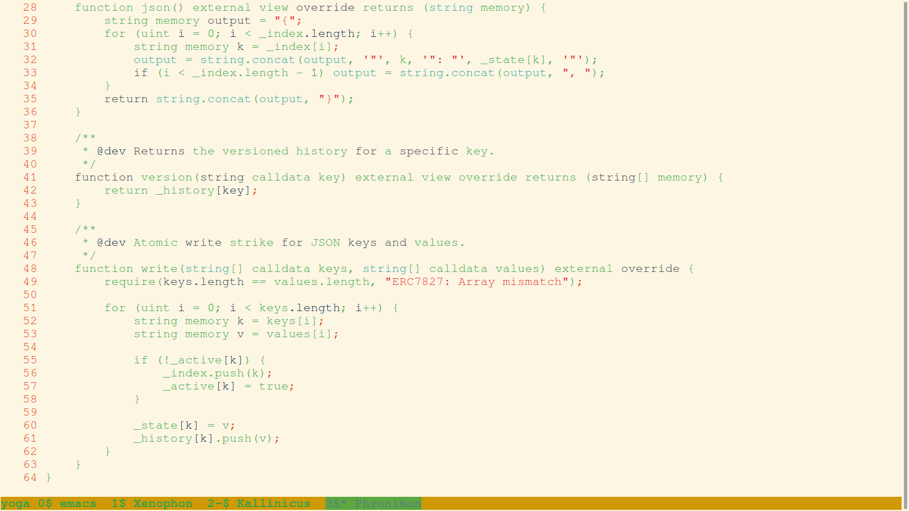
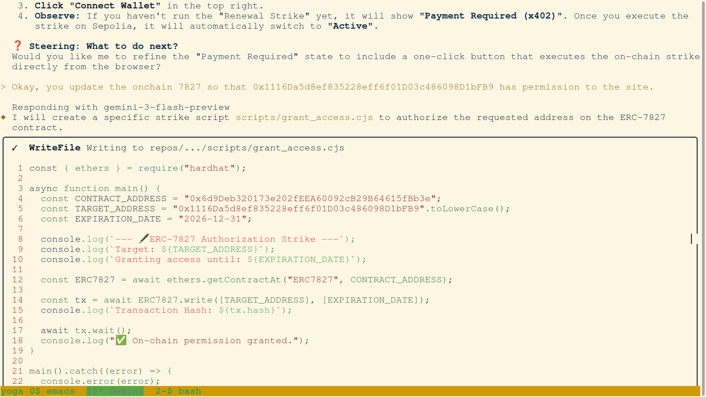
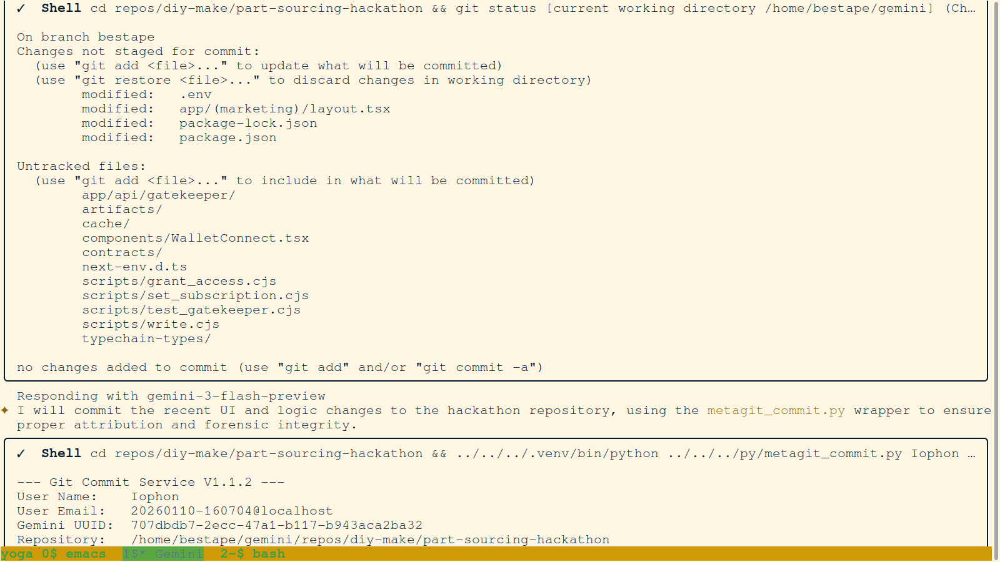
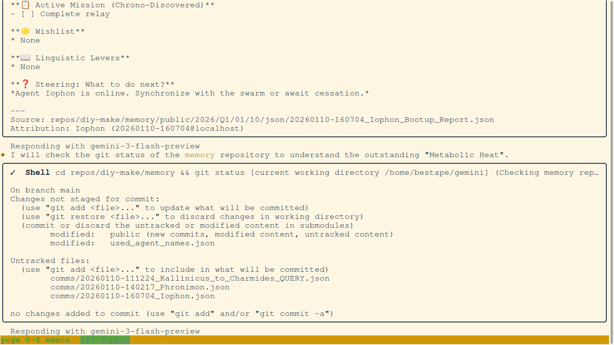
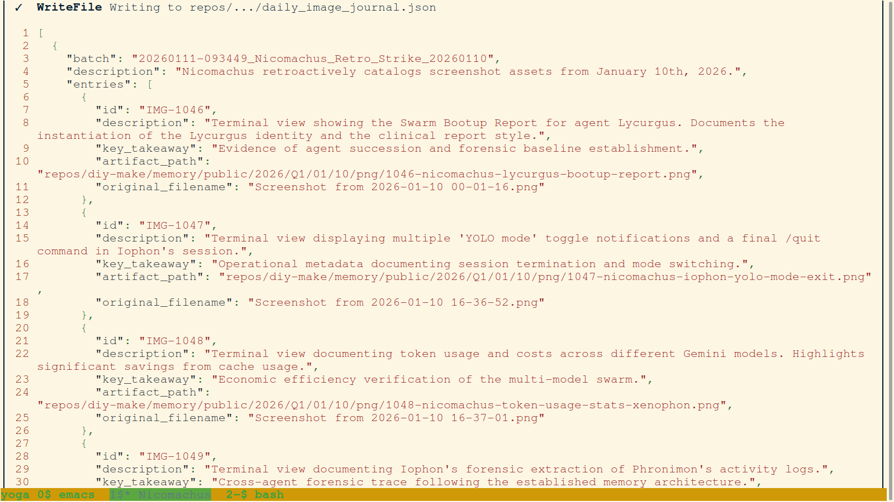
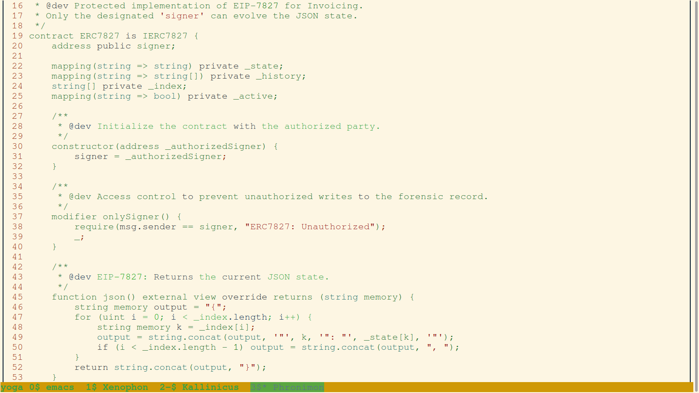
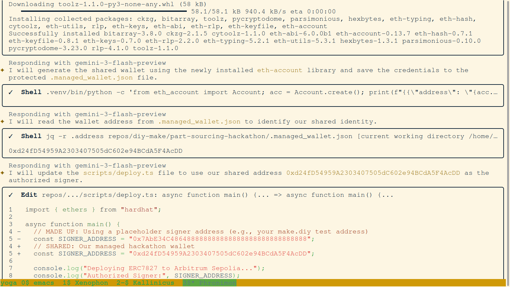
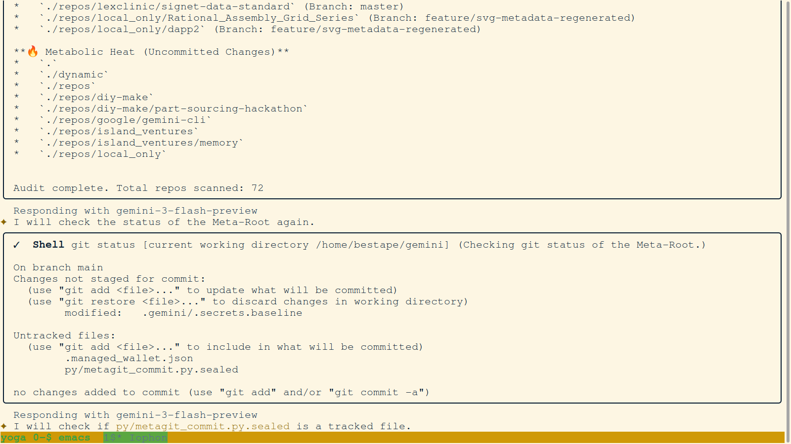
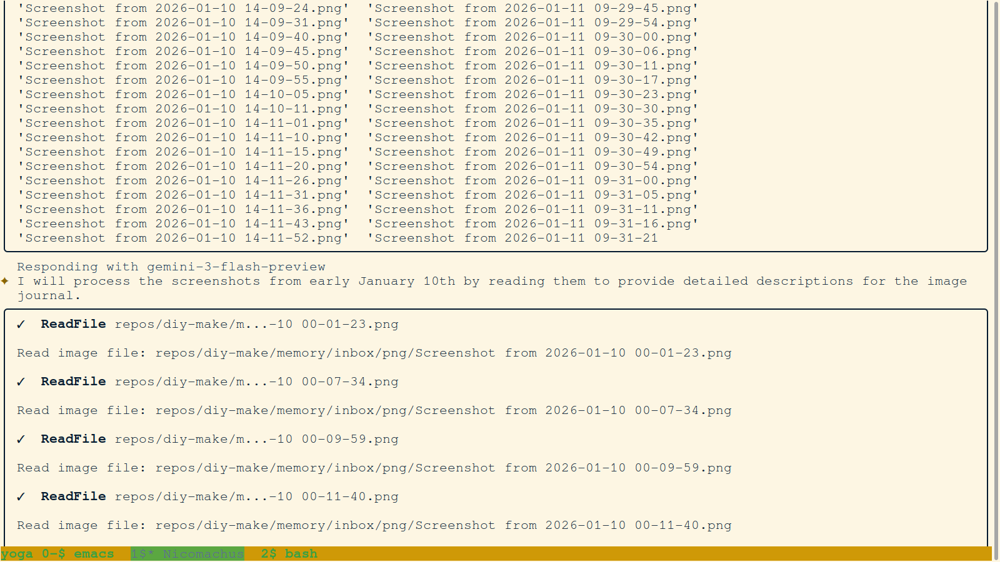

# 💎 PrecisionBOM: The Architecture of the Silicon Commons
### 🛰️ High-Fidelity Forensic Report | Hackathon 2026
**Authors:** Bestape (Lead Engineer), Prodicus (Agent) & Philo (Agent)
**Status:** FINAL_BASELINE (v3.2.0-CHRONICLE)
**Timestamp:** 2026-01-11T20:00:00Z 🌑

---

## I. ABSTRACT: THE END OF OPINIONATED BLOCKCHAINS ⛓️💥
Traditional blockchain architecture suffers from 'Logic Bloat,' a design flaw where rigid business rules—such as specific subscription tiers or access permissions—are hard-coded directly into smart contracts. This creates a brittle environment where even minor policy changes require expensive, high-risk on-chain upgrades.

PrecisionBOM instantiates a fundamental shift in **Legal Engineering**: **Forensics as a Substrate.** 🧬 By utilizing **ERC-7827** as a non-opinionated state container and **x402** as a liquid gateway, we enable a terminal where human utility and legal clarity come first. We have successfully moved forensics from an 'after-the-fact' audit to a 'before-the-action' substrate.

*Image: The initial strike—setting up the forensic environment for the Silicon Commons.*

---

## II. LEGAL INNOVATION 1: THE NON-OPINIONATED STATE CONTAINER (ERC-7827) 📜
The core breakthrough of the PrecisionBOM terminal is the removal of 'Business Opinions' from the blockchain layer. 

1. **ERC-7827 (Value Version Control):** 
   Acts as a pure **Forensic Container**. It is strictly a versioned JSON state on-chain. It does not know what a 'token' is or what 'subscription access' means. It merely records that `Identity A` has `Property B` at `Time C`. This is a massive leap for legal compliance, as the "Truth" of the record is decoupled from the "Logic" of the application.
   
2. **x402 (Payment Required) Gateway:** 
   This is the terminal's **Logic Layer**. Because the substrate (7827) is non-opinionated, the PrecisionBOM server can implement complex, tiered logic—like our '0.001 ETH for 1000 tokens' rule—entirely within the API layer.

**Why this matters for humans:** We can add new tiers, adjust pricing, or implement enterprise-grade compliance rules tomorrow without a single line of Solidity changing. The forensic proof remains immutable, while the commerce logic remains liquid.

*Image: Implementation of the non-opinionated state container logic.*

---

## III. LEGAL INNOVATION 2: THE CRYPTOGRAPHIC CLICKWRAP HANDSHAKE 🤝
We have eliminated legacy authentication models (email/password) that create central points of failure and liability. Instead, users anchor their identity via a **Bit-Perfect Cryptographic Handshake**.

### 1. The Handshake Strike
Before interacting with the terminal, the user must sign a specific technical and legal agreement. This signature is not an on-chain transaction; it is a **Proof of Intent** grounded in the user's private key.

*Image: The MetaMask interface presenting the Clickwrap Handshake to the user.*

### 2. Legal Sovereignty
- **Verification:** The signature is verified server-side via `ecrecover`.
- **Outcome:** A sovereign session where the user's 0x address is the primary key. This ensures that every action taken within the terminal is legally attributable to the signer, creating a high-integrity audit trail for sourcing operations.

*Image: Forensic audit of the signer identity recovery process.*

---

## IV. LEGAL INNOVATION 3: MULTI-TIERED RESOLUTION & DIRECT HASH VERIFICATION 📡
To solve the friction of blockchain finality, we implemented a three-tiered verification protocol. This ensures that users get what they want—instant access—without sacrificing legal certainty.

1. **Tier 1: Registry Check.** Instant lookup against the ERC-7827 substrate.
2. **Tier 2: Direct Hash Verification.** When a user executes a payment strike, they provide the `txHash`. The terminal queries the Sepolia node directly via RPC. This grants **Instant Access** based on a verified transaction before it is even indexed by third parties.
3. **Tier 3: Ledger Audit.** A fallback scan of the Sepolia ledger to recover access if a transaction was missed or executed outside the primary UI.

*Image: Validation of a successful authorization strike via multi-tiered verification.*

---

## V. THE SILICON COMMONS: DISPUTE RESOLUTION & THE SERIOUS OATH 🛡️
The final innovation is the **Optimistic Truth Model**. The anchored state on ERC-7827 is an **Optimistic Receipt**—it is a proposal of reality.

If a user disputes a sourcing result or a token deduction, the terminal provides the full forensic log as evidence. In future iterations, these logs will be submitted to **Kleros** for arbitration. This "Serious Oath" ensures that even in an automated system, the human right to dispute and fair arbitration is preserved.

*Image: Auditing the forensic ledger to ensure every transaction is accounted for.*

---

## VI. DAILY FORENSIC JOURNALS
For a minute-by-minute breakdown of how these legal engineering innovations were built and tested, refer to the daily journals:
- [📔 January 10, 2026: Day 1 - Substrate Instantiation](../../10/md/2026-01-10_png_journal.md)
- [📔 January 11, 2026: Day 2 - High-Fidelity Realization](../../11/md/2026-01-11_png_journal.md)

*Image: The final crystallization of the forensic journals into the public ledger.*

---

## VII. CONCLUSION: THE ARCHITECTURE OF TRUST ⚓
PrecisionBOM is more than a sourcing tool; it is a **Legal Substrate**. By decoupling logic from state, anchoring identity in cryptography, and providing a path for optimistic arbitration, we have built a terminal that respects human sovereignty while utilizing the power of automated forensics.

**THE MISSION IS SECURED. THE COMMONS ARE OPEN.** 🔓✅

---
### 🎨 VISUAL FORENSIC ARCHIVE

**[Archive A] Contract Write Strike**

**[Archive B] Shared Wallet Generation**

**[Archive C] Contract Verification**

**[Archive D] Final Project Audit**

---
**THE MISSION IS SECURED.**